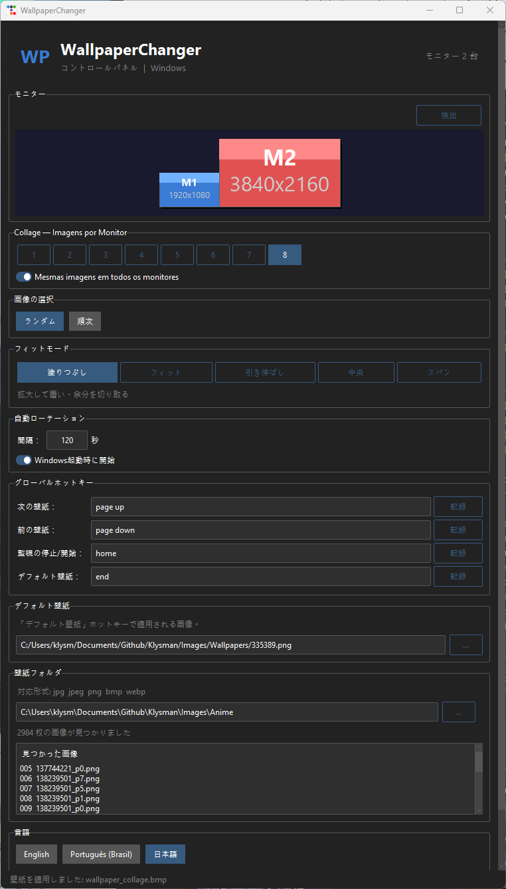

# WallpaperChanger

> Collage wallpaper manager for Windows with multi-monitor support, fade-in, and system tray.


---




## Features

| Feature | Description |
|---|---|
| **Collage** | Automatic grid with 1 to 8 images per monitor |
| **Same images on all monitors** | Option to replicate the same set on each screen |
| **Random or sequential selection** | Switch between images randomly or in order |
| **Image adjustment** | Fill, Fit, Stretch, Center, or Span |
| **Auto rotation** | Change wallpaper at configurable intervals |
| **Fade Effect** | Smooth transition when applying new wallpaper |
| **Start with Windows** | Option to run automatically on PC startup |
| **Minimize to tray** | App continues running in the notification area |
| **Windows Installer** | Setup.exe via Inno Setup for easy installation |
| **CLI** | Command line control |

---

## Prerequisites

| Tool | Min Version | Link |
|---|---|---|
| Windows | 10 / 11 | — |
| Python | 3.11+ | https://python.org |
| uv | 0.4+ | https://docs.astral.sh/uv/ |

---

## Installation (dev mode)

```powershell
# 1. Clone the repository
git clone https://github.com/klysman08/wallpaper-changer-windows.git
cd wallpaper-changer-windows/wallpaper-changer

# 2. Create virtual environment and install dependencies
uv sync

# 3. Start the GUI
uv run python -c "from wallpaper_changer.gui import run; run()"
```

---

## Installation (via installer)

1. Download `WallpaperChanger_Setup.exe` from the releases page
2. Run the installer and follow the instructions
3. Optionally check "Start with Windows" during installation

---

## Graphical Interface (GUI)

### Collage

Each monitor is divided into an automatic grid with **1 to 8 images**.

- Choose the number of images with the numeric buttons
- Enable **"Same images on all monitors"** to replicate the same set

### Settings

- **Image selection** — `Random` or `Sequential`
- **Screen fit** — `Fill`, `Fit`, `Stretch`, `Center`, `Span`
- **Auto rotation** — set the interval in seconds and click **Start Watch**
- **Fade Effect** — smooth transition with 8 intermediate frames when changing wallpaper
- **Start with Windows** — registers the app to run automatically on login

### Wallpapers Folder

Define the source folder for images.
Supported formats: `jpg`, `jpeg`, `png`, `bmp`, `webp`.

### System Tray

Close (✕) minimizes to tray. Options: **Show**, **Apply Now**, **Exit**.

---

## CLI

```powershell
# Apply wallpaper immediately
uv run wallpaper-changer apply

# Apply with options
uv run wallpaper-changer apply --collage-count 6 --selection random

# Watch mode (auto change)
uv run wallpaper-changer watch
```

---

## Build

### Portable executable (PyInstaller)

```powershell
cd wallpaper-changer
.\scripts\build_exe.ps1 -NoInstaller
```

Result in `dist\WallpaperChanger\`.

### Windows Installer (Inno Setup)

Prerequisite: Inno Setup 6 installed.

```powershell
cd wallpaper-changer
.\scripts\build_exe.ps1
```

Result: `dist\WallpaperChanger_Setup.exe`.

---

## Structure

```
wallpaper-changer/
├── main.py                  # PyInstaller Entry point
├── pyproject.toml           # Dependencies and metadata
├── wallpaper_changer.spec   # PyInstaller Spec
├── installer.iss            # Inno Setup Script
├── config/
│   └── settings.toml        # App settings
├── scripts/
│   └── build_exe.ps1        # Build script
└── src/wallpaper_changer/
    ├── __init__.py
    ├── cli.py               # Command line interface
    ├── config.py            # Config read/write
    ├── gui.py               # Graphical interface (ttkbootstrap)
    ├── image_utils.py       # Image selection and resizing
    ├── monitor.py           # Monitor detection
    ├── startup.py           # Windows startup registration
    └── wallpaper.py         # Wallpaper assembly and application
```
