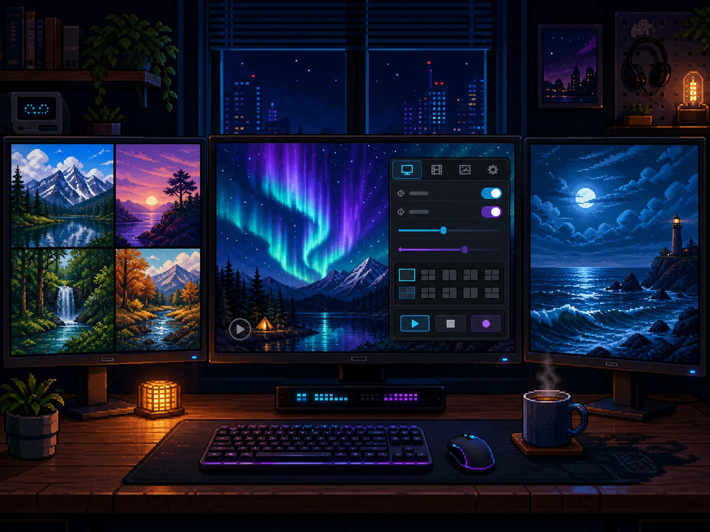

# 🖼️ WallpaperChanger

> The most powerful free collage & live video wallpaper manager for Windows. Multi-monitor, multi-language, auto-rotation, smooth transitions, and zero bloat.

[](https://python.org)
[](https://microsoft.com)
[](https://opensource.org/license/mit)
[](https://github.com/klysman08/wallpaper-changer-windows/releases)
[](https://wallpaper.astrofocus.app/)

---



## 🌟 Why WallpaperChanger?

Most wallpaper utilities are either simplistic slideshows that can't handle multiple displays, or resource-heavy tools locked behind subscriptions and ads. **WallpaperChanger** is built to bridge this gap, offering premium, highly customizable features completely free, open-source, and offline.

| Feature | Other Wallpaper Utilities | WallpaperChanger Solution |
| :--- | :--- | :--- |
| **Multi-Monitor Layouts** | ✗ Single image stretched or forced per screen | ✓ **Collage Mode**: Custom grid of 1–8 images per monitor |
| **Live Wallpapers** | ✗ Restricted, resource-heavy, or paid | ✓ **Video Wallpaper**: Stable, aspect-correct playback via `libmpv` |
| **Transitions** | ✗ Instant, jarring cuts | ✓ **Native Fade**: Uses Windows' built-in wallpaper transition |
| **System Footprint** | ✗ Taskbar hog, telemetry, ads, account required | ✓ **Zero Bloat**: Runs silently in the system tray, 100% telemetry-free |
| **Language Support** | ✗ English only | ✓ **Multi-Language**: Full English, Português, and Japanese UI |
| **Automation & Scripts** | ✗ GUI-only configuration | ✓ **CLI Console**: Execute transitions, play videos, and run watch cycles |

---

## ✨ Features

Version 4.0 adds a tabbed control panel, stable multi-monitor video playback,
reliable main-thread shortcut dispatch, shortcut conflict validation, serialized
wallpaper changes, atomic settings saves, and rotating diagnostic logs. See
[the v4 plan](docs/V4_PLAN.md) for the architecture review and delivered
reliability work.

- **Collage Grid**: Automatic grid layouts of 1 to 8 images per monitor.
- **Video Wallpaper**: Render `.mp4`, `.mkv`, `.webm`, `.mov`, and other common video formats behind your desktop icons using `libmpv`, with optional audio, looping, and playlist controls.
- **Stable Video Rendering**: Uses D3D11 presentation with stability-focused software decoding, avoiding fragile hardware-decoder surfaces while retaining smooth GPU composition.
- **Native Fade Transitions**: Lets Windows apply its built-in wallpaper fade with no custom animation loop or desktop flicker.
- **Auto-Rotation**: Watch cycles automatically rotate your backgrounds at set intervals.
- **Window Transparency**: Focus adjustments allowing slider control, toggle hotkeys (`Alt+A`), or Scroll adjustments (modifiers like `Alt`, `Ctrl`, `Shift`, `Win`) for any window.
- **Global Hotkeys**: Control next/previous wallpaper, effect configurations, and video controls (mute, playlist traversal) globally.
- **System Tray**: Hides to the notification area with full right-click context menu options.
- **Auto-Save Settings**: Settings persist on every apply automatically.
- **Start with Windows**: Silently runs at login directly into the tray.
- **Windows Installer**: One-click installer with language and startup options.

---

## 🚀 Quick Start

### Option A — Installer (Recommended)
1. Download **`WallpaperChanger_Setup.exe`** from the [GitHub Releases](https://github.com/klysman08/wallpaper-changer-windows/releases) page.
2. Run the installer (pick your default language, desktop shortcut, and startup options).
3. Point the application to your wallpapers directory or video directory and hit **Start Watch / Play**.

### Option B — From Source (Requires `uv`)
```powershell
# 1. Clone the repository
git clone https://github.com/klysman08/wallpaper-changer-windows.git
cd wallpaper-changer-windows/wallpaper-changer

# 2. Sync dependencies
uv sync

# 3. Launch GUI
uv run wallpaper-changer-gui
```

#### Prerequisites for Building
| Tool | Minimum Version | Reference |
| :--- | :--- | :--- |
| **Windows** | 10 / 11 | — |
| **Python** | 3.11+ | [python.org](https://python.org) |
| **uv** | 0.4+ | [docs.astral.sh/uv/](https://docs.astral.sh/uv/) |

---

## 🎛️ Detailed Configuration

### 1. Video Wallpapers
Point the app at a directory of background videos. `libmpv` renders each display
into the desktop `WorkerW` layer while the app keeps playback controls responsive
and tears down native resources safely.

- Supports loop vs single playback.
- Optional track audio playback toggle.
- Aspect ratio preservation (preserves 9:16 vertical clips on horizontal displays without stretching).
- Previous/next controls keep every monitor on the same playlist item.

### 2. Image Effects
Switch rendering mode styles instantly on the current wallpaper collage:
- **Normal**
- **Black & White** (Greyscale conversion)
- **Vintage** (Sepia styling)
- **HDR** (Dynamic contrast enhancements)

### 3. Window Transparency
- Adjust alpha transparency (50 to 255) for active windows.
- Scroll opacity adjustments: hold your chosen modifier key (`Alt`/`Ctrl`/`Shift`/`Win`) and scroll the mouse wheel to dynamically fade/reveal the window under your cursor.
- Opacity configurations persist automatically inside `config/transparency.json`.

---

## ⌨️ Global Hotkeys

| Action | Default Shortcut | Customisable |
| :--- | :--- | :---: |
| **Next Wallpaper** | `Ctrl+Alt+Right` | Yes |
| **Previous Wallpaper** | `Ctrl+Alt+Left` | Yes |
| **Stop/Start Watch** | `Ctrl+Alt+S` | Yes |
| **Default Wallpaper** | `Ctrl+Alt+D` | Yes |
| **Toggle Window GUI** | `Ctrl+Alt+W` | Yes |
| **Toggle Active Opacity** | `Alt+A` | Yes |
| **Effect: Normal** | `Ctrl+Alt+1` | Yes |
| **Effect: Black & White** | `Ctrl+Alt+2` | Yes |
| **Effect: Vintage** | `Ctrl+Alt+3` | Yes |
| **Effect: HDR** | `Ctrl+Alt+4` | Yes |
| **Toggle Video Wallpaper** | `Ctrl+Alt+V` | Yes |
| **Toggle Video Sound** | `Ctrl+Alt+M` | Yes |
| **Next Video** | `Ctrl+Alt+.` | Yes |
| **Previous Video** | `Ctrl+Alt+,` | Yes |

---

## 💻 Command Line Interface (CLI)

Execute core wallpaper routines from PowerShell or script pipelines:

```powershell
# Apply wallpaper immediately
uv run wallpaper-changer apply

# Apply collage with 6 images per monitor randomly selected
uv run wallpaper-changer apply --collage-count 6 --selection random

# Apply with a custom image effect
uv run wallpaper-changer apply --effect vintage

# Enable watch mode (auto rotation)
uv run wallpaper-changer watch

# Launch video wallpaper playback loop
uv run wallpaper-changer video --folder "C:\Videos\live" --loop
```

---

## ⚙️ Configuration Properties (`config/settings.toml`)

```toml
[general]
mode                 = "collage"
selection            = "random"
interval             = 300
collage_count        = 4
collage_same_for_all = false
language             = "en"

[paths]
wallpapers_folder = "C:\\Users\\Public\\Pictures"
output_folder     = "assets/output"
default_wallpaper = ""

[display]
fit_mode            = "fill"
effect              = "normal"   # normal | bw | vintage | hdr

[hotkeys]
next_wallpaper    = "ctrl+alt+right"
prev_wallpaper    = "ctrl+alt+left"
stop_watch        = "ctrl+alt+s"
default_wallpaper = "ctrl+alt+d"
toggle_transparency = "alt+a"
toggle_window     = "ctrl+alt+w"
scroll_modifier   = "alt"        # alt | ctrl | shift | win
effect_normal     = "ctrl+alt+1"
effect_bw         = "ctrl+alt+2"
effect_vintage    = "ctrl+alt+3"
effect_hdr        = "ctrl+alt+4"
toggle_video      = "ctrl+alt+v"
toggle_video_sound = "ctrl+alt+m"
next_video        = "ctrl+alt+."
prev_video        = "ctrl+alt+,"

[video]
enabled = false
folder  = "C:/Users/YourName/Videos/Wallpapers"
loop    = false
sound   = true
```

---

## 🏗️ Build Pipelines

### Portable Executable (PyInstaller)
Compile WallpaperChanger into a portable folder bundle:
```powershell
.\scripts\build_exe.ps1 -NoInstaller
```
Target directory output: `dist\WallpaperChanger\`

### Windows Installer (Inno Setup 6)
Build the standalone language-aware executable installer:
```powershell
.\scripts\build_exe.ps1
```
Target installer output: `dist\WallpaperChanger_Setup.exe`

---

## 📂 Project Structure

```
wallpaper-changer/
├── main.py                  # CLI & GUI entry point
├── pyproject.toml           # Dependecy & builds metadata
├── wallpaper_changer.spec   # PyInstaller specifications
├── installer.iss            # Inno Setup 6 scripting
├── config/
│   ├── settings.toml        # Application configurations
│   └── transparency.json    # Opacity cache
├── scripts/
│   └── build_exe.ps1        # Execution script
└── src/wallpaper_changer/
    ├── __init__.py
    ├── cli.py               # Command-line router
    ├── config.py            # TOML parser
    ├── gui.py               # tkBootstrap visual layout
    ├── hotkeys.py           # Win32 global hotkeys register
    ├── i18n.py              # i18n locales (en, pt_BR, ja)
    ├── image_utils.py       # Grids, sizes & effect modifiers
    ├── monitor.py           # Win32 screen positioning
    ├── startup.py           # Login registers
    ├── transition.py        # Native Windows wallpaper transition
    ├── transparency.py      # Win32 active transparency
    ├── video_wallpaper.py   # libmpv video player lifecycle
    ├── workerw.py           # Desktop WorkerW discovery
    └── wallpaper.py         # Canvas rendering
```

---

## 📄 License

MIT © WallpaperChanger Contributors — free for personal and commercial usage.
