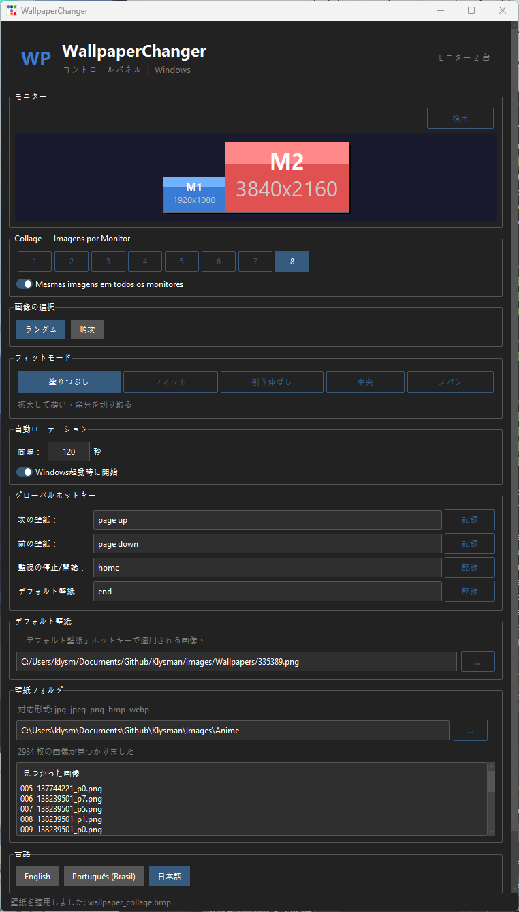

# WallpaperChanger

> The most powerful free collage wallpaper manager for Windows — multi-monitor, multi-language, auto-rotation, and zero bloat.


---



## Why WallpaperChanger?

Most wallpaper apps fall into two categories: simple slideshows that only handle one image at a time, or paid tools locked behind subscriptions. **WallpaperChanger** fills the gap by offering features that usually require premium software — completely free and open-source.

| Problem with other apps | WallpaperChanger solution |
|---|---|
| Single image per screen only | **Collage mode** — grid of 1–8 images per monitor |
| No real multi-monitor awareness | Detects every monitor, respects resolution and position |
| Always visible in the taskbar | Runs silently in the **system tray** |
| English-only interfaces | **3 languages** — English, Português (Brasil), 日本語 |
| No auto-start or background rotation | **Start with Windows** → launches to tray with auto-rotation |
| Abrupt wallpaper changes | **Smooth fade transition** at 30 fps via WorkerW injection |
| Paid or ad-supported | 100% free, MIT licensed, no telemetry |
| Complex installers or manual setup | One-click **Windows Installer** with language selection |

---

## Features

| Feature | Description |
|---|---|
| **Collage grid** | Automatic layout with 1 to 8 images per monitor |
| **Same images on all monitors** | Option to replicate the same collage on every screen |
| **Random or sequential selection** | Switch between images randomly or in order |
| **Image fit modes** | Fill, Fit, Stretch, Center, or Span |
| **Image effects** | Normal, Black & White, Vintage, or HDR — switchable instantly via hotkey |
| **Fade transition** | Smooth 30 fps crossfade between wallpapers using GDI WorkerW rendering |
| **Auto rotation** | Change wallpaper at configurable intervals (seconds) |
| **Auto-save settings** | Every apply persists current settings — no manual Save needed |
| **Start with Windows** | Launches to system tray with auto-rotation enabled |
| **System tray** | App lives in the notification area — right-click for quick actions |
| **Multi-language GUI** | English, Português (Brasil), 日本語 — switchable in settings |
| **Global hotkeys** | Next / Previous / Stop / Default wallpaper + effect switching via keyboard |
| **Window transparency** | Control any window's opacity via GUI slider or shortcuts (toggle + scroll) |
| **Configurable scroll modifier** | Choose which key (Alt / Ctrl / Shift / Win) activates transparency scroll |
| **Wallpaper history** | Navigate back to previously applied wallpapers |
| **Default wallpaper** | Assign a fallback image applied via hotkey |
| **Windows Installer** | Setup.exe via Inno Setup — includes language selection during install |
| **CLI** | Full command-line control for scripting and automation |

---

## Quick Start

### Option A — Installer (recommended)

1. Download **`WallpaperChanger_Setup.exe`** from the [Releases](https://github.com/klysman08/wallpaper-changer-windows/releases) page
2. Run the installer — choose your language, shortcuts, and startup preference
3. Launch the app and point it at your wallpapers folder

### Option B — From source

```powershell
# 1. Clone the repository
git clone https://github.com/klysman08/wallpaper-changer-windows.git
cd wallpaper-changer-windows/wallpaper-changer

# 2. Install dependencies
uv sync

# 3. Start the GUI
uv run wallpaper-changer-gui
```

### Prerequisites (source only)

| Tool | Min Version | Link |
|---|---|---|
| Windows | 10 / 11 | — |
| Python | 3.11+ | https://python.org |
| uv | 0.4+ | https://docs.astral.sh/uv/ |

---

## Graphical Interface

### Monitor Detection

WallpaperChanger automatically detects all connected monitors, showing a live preview with resolution and position. Click **Detect** to refresh after plugging in a display.

### Collage

Each monitor is divided into an automatic grid with **1 to 8 images**.

- Choose the number of images with the numeric buttons
- Enable **"Same images on all monitors"** to replicate the same set across all screens

### Settings

- **Image selection** — `Random` or `Sequential`
- **Screen fit** — `Fill`, `Fit`, `Stretch`, `Center`, `Span`
- **Image effect** — `Normal`, `Black & White`, `Vintage`, `HDR`
- **Auto rotation** — set the interval in seconds and click **Start Watch**

### Fade Transition

Every wallpaper change is animated with a smooth **crossfade at 30 fps**. The transition is rendered directly onto the Windows desktop layer (WorkerW) using GDI blitting — no flicker, no abrupt cuts.

### Auto-Save

Settings are **saved automatically on every Apply** — including image effect, fit mode, folder, and all hotkeys. Restarting the app or the computer will always restore the last configuration. The explicit "Save Config" button is still available but is no longer required.

### Start with Windows

When this option is enabled, the app registers itself to launch at login. On startup it goes **directly to the system tray** and automatically begins the wallpaper rotation — no window pops up, no interaction needed.

### Language

Switch between **English**, **Português (Brasil)**, and **日本語** from the Language section inside the app. The change is saved immediately; restart the app to apply it fully. The installer also lets you pick the default language during installation.

### Wallpapers Folder

Define the source folder for images.  
Supported formats: `jpg`, `jpeg`, `png`, `bmp`, `webp`.

### Global Hotkeys

| Action | Default shortcut |
|---|---|
| Next wallpaper | `Ctrl+Alt+Right` |
| Previous wallpaper | `Ctrl+Alt+Left` |
| Stop/Start Watch | `Ctrl+Alt+S` |
| Default wallpaper | `Ctrl+Alt+D` |
| Toggle transparency | `Alt+A` |
| Open/Close app window | `Ctrl+Alt+W` |
| **Effect: Normal** | `Ctrl+Alt+1` |
| **Effect: Black & White** | `Ctrl+Alt+2` |
| **Effect: Vintage** | `Ctrl+Alt+3` |
| **Effect: HDR** | `Ctrl+Alt+4` |

All shortcuts are fully customizable from the **Hotkeys** section in the GUI. Effect hotkeys switch the active effect and immediately apply the wallpaper.

### Window Transparency

Control the opacity of any open window directly from the app:

- **ComboBox** — select any visible window from a filterable list
- **Slider** — adjust opacity in real-time (range 50–255)
- **Toggle shortcut** (`Alt+A`) — press once for 50% transparency, press again to restore
- **Scroll shortcut** — hold the configured modifier key and scroll to gradually adjust the focused window's opacity
- **Configurable modifier** — choose which key activates scroll transparency (`Alt`, `Ctrl`, `Shift`, or `Win`) in the Hotkeys section
- **Persistence** — opacity settings are saved to `config/transparency.json` and restored on next launch

### System Tray

Closing the window (✕) or clicking **Tray** minimizes the app to the notification area. Right-click the tray icon for: **Show**, **Apply Now**, **Quit**.

---

## CLI

```powershell
# Apply wallpaper immediately
uv run wallpaper-changer apply

# Apply with options
uv run wallpaper-changer apply --collage-count 6 --selection random

# Apply with image effect
uv run wallpaper-changer apply --effect vintage

# Watch mode (auto change at configured interval)
uv run wallpaper-changer watch
```

---

## Configuration (`config/settings.toml`)

```toml
[general]
mode                 = "collage"
selection            = "random"
interval             = 300
collage_count        = 4
collage_same_for_all = false
language             = "en"

[paths]
wallpapers_folder = "C:\\Users\\Public\\Pictures"
output_folder     = "assets/output"
default_wallpaper = ""

[display]
fit_mode            = "fill"
effect              = "normal"   # normal | bw | vintage | hdr
transition          = "fade"
transition_duration = 0.6
transition_fps      = 30

[hotkeys]
next_wallpaper    = "ctrl+alt+right"
prev_wallpaper    = "ctrl+alt+left"
stop_watch        = "ctrl+alt+s"
default_wallpaper = "ctrl+alt+d"
toggle_window     = "ctrl+alt+w"
scroll_modifier   = "alt"        # alt | ctrl | shift | win
effect_normal     = "ctrl+alt+1"
effect_bw         = "ctrl+alt+2"
effect_vintage    = "ctrl+alt+3"
effect_hdr        = "ctrl+alt+4"
```

---

## Build

### Portable executable (PyInstaller)

```powershell
.\scripts\build_exe.ps1 -NoInstaller
```

Result in `dist\WallpaperChanger\`.

### Windows Installer (Inno Setup)

Prerequisite: [Inno Setup 6](https://jrsoftware.org/isinfo.php) installed.

```powershell
.\scripts\build_exe.ps1
```

Result: `dist\WallpaperChanger_Setup.exe`.

---

## Project Structure

```
wallpaper-changer/
├── main.py                  # PyInstaller entry point
├── pyproject.toml           # Dependencies and metadata
├── wallpaper_changer.spec   # PyInstaller spec
├── installer.iss            # Inno Setup script
├── config/
│   ├── settings.toml        # App settings (language, paths, fit/effect, hotkeys…)
│   └── transparency.json    # Persisted window opacity settings
├── scripts/
│   └── build_exe.ps1        # Build script
└── src/wallpaper_changer/
    ├── __init__.py
    ├── cli.py               # Command-line interface
    ├── config.py            # Config read/write (TOML)
    ├── gui.py               # Graphical interface (ttkbootstrap)
    ├── hotkeys.py           # Global hotkey registration
    ├── i18n.py              # Internationalization (en, pt_BR, ja)
    ├── image_utils.py       # Image selection and resizing
    ├── monitor.py           # Monitor detection (Win32)
    ├── startup.py           # Windows startup registration
    ├── transition.py        # Fade transition engine (WorkerW + GDI)
    ├── transparency.py      # Window transparency control (Win32 + persistence)
    └── wallpaper.py         # Wallpaper assembly and application
```

---

## License

MIT — free for personal and commercial use.
