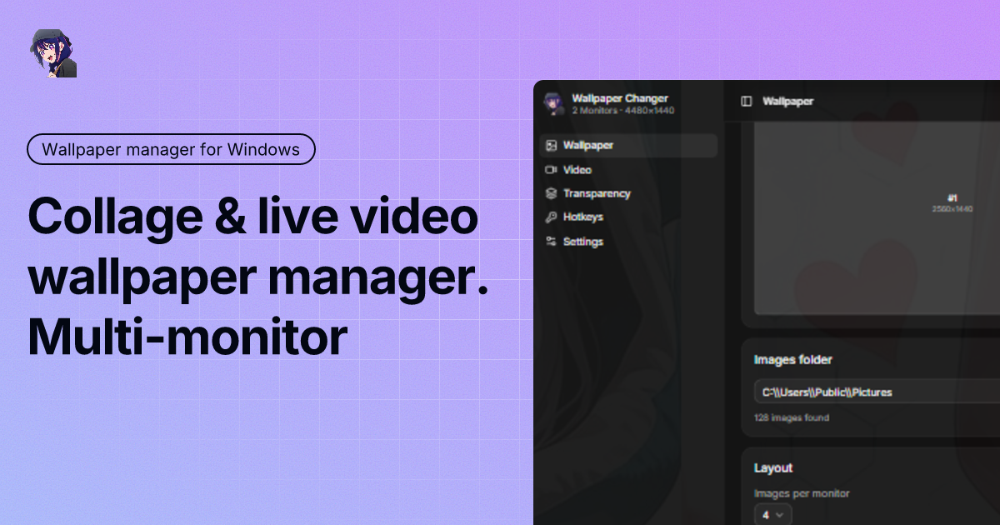

# WallpaperChanger

> The most powerful free collage & live video wallpaper manager for Windows. Multi-monitor, multi-language, auto-rotation, smooth transitions, and zero bloat.

[](https://tauri.app)
[](https://react.dev)
[](https://rust-lang.org)
[](https://microsoft.com)
[](https://opensource.org/license/mit)
[](https://wallpaper.astrofocus.app/)

---



## Why WallpaperChanger?

Most wallpaper utilities are either simplistic slideshows that cannot handle multiple displays, or resource-heavy tools locked behind subscriptions and ads. **WallpaperChanger** is built to bridge this gap, offering premium, highly customizable features completely free, open-source, and offline.

| Feature | Other Wallpaper Utilities | WallpaperChanger Solution |
| :--- | :--- | :--- |
| **Multi-Monitor Layouts** | Single image stretched or forced per screen | **Collage Mode**: custom grid of 1-8 images per monitor |
| **Live Wallpapers** | Restricted, resource-heavy, or paid | **Video Wallpaper**: stable, aspect-correct playback via `libmpv` |
| **Transitions** | Instant, jarring cuts | **Native Fade**: uses the built-in Windows wallpaper transition |
| **System Footprint** | Taskbar hog, telemetry, ads, account required | **Zero Bloat**: runs silently in the system tray, telemetry-free |
| **Language Support** | English only | **Multi-Language**: full English, Português, and Japanese UI |
| **Automation & Scripts** | GUI-only configuration | **CLI Console**: apply wallpapers, play videos, and run watch cycles |

---

## Architecture

The desktop app is a single native process, in two halves.

```
+------------------------------------------+
|  desktop/  -  Tauri 2 shell (Rust)        |
|  React 19 + shadcn/ui + Tailwind 4        |
|  Owns: window, tray, global hotkeys       |
+---------------------+--------------------+
                      |  in-process dispatch
+---------------------v--------------------+
|  crates/wallpaper-core/  -  engine        |
|  Rust 2021, no Tauri dependency           |
|  Owns: everything touching Win32          |
+------------------------------------------+
```

**Why one process.** It used to be two: the engine was Python, frozen with PyInstaller,
speaking JSON-RPC over a pipe. v6.0 replaced it with a native crate one piece at a time,
behind a seam that kept the app working at every step. The split had bought a crash
boundary the app never actually used — there was no restart logic, so a dead engine left
a window that could only be closed — while costing a 145 MB sidecar, a second toolchain,
and a teardown that ran in the wrong process.

The engine deliberately has **no Tauri dependency**, so it stays testable without a
window; the shell injects the few things that need one. The webview still cannot spawn
anything, and still reaches the engine only through its own method allowlist.

| Layer | Technology |
| :--- | :--- |
| **Shell & window** | Tauri 2 (Rust 2021), WebView2 |
| **Interface** | React 19, TypeScript, Vite 8 |
| **Components** | shadcn/ui on Base UI, Tailwind CSS 4, lucide icons |
| **Native integration** | `tauri-plugin-global-shortcut`, `-autostart`, `-dialog`, `-notification`, `-opener`, `-log` |
| **Engine** | Rust, `image` + `fast_image_resize`, `windows`, libmpv via runtime FFI |
| **Packaging** | Tauri bundler (NSIS), with libmpv as a bundled resource |


---

## Features

- **Collage Grid**: automatic grid layouts of 1 to 8 images per monitor.
- **Live Preview**: the interface renders the real composited collage before anything touches your desktop, so effect and fit changes are visible immediately. Monitor outlines are drawn over it, any screen can be zoomed to on its own, the whole thing expands to fill the window, and what you are looking at can be applied as-is.
- **Editable Preview**: drag one picture in the preview onto another to swap them, or click one to choose a different image, before anything is applied.
- **Save & Gallery**: keep any collage as an image file - the whole desktop or a single monitor's share of it, composed at full resolution - and find every one you have saved on the Gallery screen, ready to view again or put straight back on the desktop.
- **Video Wallpaper**: render `.mp4`, `.mkv`, `.webm`, `.mov`, and other common formats behind your desktop icons using `libmpv`, with optional audio, looping, and playlist controls.
- **Stable Video Rendering**: D3D11 presentation with stability-focused software decoding, avoiding fragile hardware-decoder surfaces while retaining smooth GPU composition.
- **Native Fade Transitions**: lets Windows apply its built-in wallpaper fade, with no custom animation loop or desktop flicker.
- **Action Bar**: a persistent bar at the bottom of every screen for apply, previous, next, rotation, and video playback.
- **Auto-Rotation**: watch cycles rotate your backgrounds at a set interval.
- **Window Transparency**: slider control, a toggle hotkey, or hold a modifier of your choice (`Alt`, `Ctrl`, `Shift`, `Win`) and scroll the wheel to fade the focused window.
- **Global Hotkeys**: nothing is bound out of the box - assign only the shortcuts you want, from the Hotkeys screen.
- **System Tray**: closing hides to the notification area, with a right-click menu for the common actions, including starting and stopping rotation.
- **Start with Windows**: on by default from the first launch, and a runtime toggle, so it can be turned off again without reinstalling. A boot-time launch goes straight to the tray; **Start minimized** does the same when you open the app yourself.
- **Resumes Where You Left Off**: rotation and the video wallpaper are remembered as they are switched, and come back on the next launch.
- **Windows Installer**: NSIS installer produced by the Tauri bundler, signed so the app can update itself in place.

---

## Quick Start

### Option A - Installer (recommended)

1. Download the `-setup.exe` from the [GitHub Releases](https://github.com/klysman08/wallpaper-changer-windows/releases) page. From then on the app checks for new releases itself and can install them for you.
2. Run the installer.
3. Point the application at your wallpapers or video directory and press **Apply Now** or **Play video**.

### Option B - From source

```powershell
# 1. Clone the repository
git clone https://github.com/klysman08/wallpaper-changer-windows.git
cd wallpaper-changer-windows

# 2. Run the desktop app — the engine compiles with it
cd desktop
bun install
bun run tauri dev
```

#### Prerequisites

| Tool | Minimum Version | Reference |
| :--- | :--- | :--- |
| **Windows** | 10 / 11 | - |
| **Rust** | 1.77+ | [rustup.rs](https://rustup.rs) |
| **Bun** | 1.1+ | [bun.sh](https://bun.sh) |
| **WebView2** | Runtime | Preinstalled on Windows 11 |

---

## Detailed Configuration

### 1. Video Wallpapers

Point the app at a directory of background videos. `libmpv` renders each display into the desktop `WorkerW` layer while the app keeps playback controls responsive and tears down native resources safely.

- Supports loop and single playback.
- Optional audio toggle, applied live without restarting playback.
- Aspect ratio preservation (keeps 9:16 vertical clips intact on horizontal displays).
- Previous and next controls keep every monitor on the same playlist item.

### 2. Image Effects

Switch rendering styles on the current collage:

- **Normal**
- **Black & White** (greyscale conversion)
- **Vintage** (sepia styling)
- **HDR** (dynamic contrast enhancement)

### 3. Window Transparency

- Adjust alpha (20 to 255) for any open window with the slider.
- **Scroll to adjust**: turn it on from the Transparency screen, pick `Alt`, `Ctrl`, `Shift`, or `Win`, then hold that key and turn the wheel to fade the focused window. Off by default, because it installs a system-wide mouse hook.
- Opacity is remembered per executable, not per window, so it survives closing and reopening the application.
- Settings persist in `transparency.json` under `%APPDATA%\WallpaperChanger\`.

---

## Global Hotkeys

**No shortcut is bound after installation.** A global hotkey belongs to a single process on Windows, so claiming a dozen combinations on first run would silently take them from applications you already use. Assign the ones you want from the Hotkeys screen; the clear button unbinds one again.

Bindings use the syntax `ctrl+alt+right`, `alt+a`, `ctrl+alt+.`. The suggestions below are what earlier versions shipped with, kept here as a starting point.

| Action | Suggested Shortcut |
| :--- | :--- |
| Next wallpaper | `Ctrl+Alt+Right` |
| Previous wallpaper | `Ctrl+Alt+Left` |
| Stop / start rotation | `Ctrl+Alt+S` |
| Default wallpaper | `Ctrl+Alt+D` |
| Toggle window | `Ctrl+Alt+W` |
| Toggle active window opacity | `Alt+A` |
| Effect: normal | `Ctrl+Alt+1` |
| Effect: black & white | `Ctrl+Alt+2` |
| Effect: vintage | `Ctrl+Alt+3` |
| Effect: HDR | `Ctrl+Alt+4` |
| Toggle video wallpaper | `Ctrl+Alt+V` |
| Toggle video sound | `Ctrl+Alt+M` |
| Next video | `Ctrl+Alt+.` |
| Previous video | `Ctrl+Alt+,` |

If a binding fails to register, another application already owns it - the interface reports which ones did not take.

---

## Command Line Interface

Execute core wallpaper routines from PowerShell or script pipelines:

The application binary *is* the CLI — give it a subcommand and it runs headless instead
of opening a window.

```powershell
$app = "$env:LOCALAPPDATA\Programs\Wallpaper Changer\Wallpaper Changer.exe"

# Apply the wallpaper immediately
& $app apply

# Six images per monitor, chosen at random
& $app apply --collage-count 6 --selection random

# Apply with an effect
& $app apply --effect vintage

# Rotate on the configured interval until Ctrl+C
& $app watch

# Play a folder as a video wallpaper until Ctrl+C
& $app video --folder "C:\Videos\live"
```

---

## Configuration

User files live outside the installation directory, so the app works correctly when installed under `Program Files`:

| Location | Contents |
| :--- | :--- |
| `%APPDATA%\WallpaperChanger\` | `settings.toml`, `state.json`, `transparency.json` |
| `%LOCALAPPDATA%\WallpaperChanger\` | Composed wallpaper output |

On first run the app copies any settings from an older in-install `config/` directory into `%APPDATA%`; it never moves or overwrites. Both locations can be redirected with the `WALLPAPER_CHANGER_CONFIG_DIR` and `WALLPAPER_CHANGER_DATA_DIR` environment variables.

```toml
[general]
mode                 = "collage"
selection            = "random"
interval             = 300
collage_count        = 4
collage_same_for_all = false
language             = "en"

[paths]
wallpapers_folder = "C:\\Users\\Public\\Pictures"
output_folder     = "output"          # relative paths resolve under %LOCALAPPDATA%
default_wallpaper = ""

[display]
fit_mode = "fill"                     # fill | fit | stretch | center | span
effect   = "normal"                   # normal | bw | vintage | hdr

# Empty means "not registered". Assign shortcuts from the Hotkeys screen.
[hotkeys]
next_wallpaper      = ""
prev_wallpaper      = ""
stop_watch          = ""
default_wallpaper   = ""
toggle_transparency = ""
toggle_window       = ""
# Not shortcuts: hold scroll_modifier and turn the wheel to fade the focused
# window. Off by default because it installs a system-wide mouse hook.
scroll_enabled      = false
scroll_modifier     = "alt"           # alt | ctrl | shift | win
effect_normal       = ""
effect_bw           = ""
effect_vintage      = ""
effect_hdr          = ""
toggle_video        = ""
toggle_video_sound  = ""
next_video          = ""
prev_video          = ""

[video]
enabled = false
folder  = "C:/Users/YourName/Videos/Wallpapers"
loop    = false
sound   = true
```

---

## Build Pipelines

The Tauri bundler produces the installers, so there is no separate Inno Setup step and nothing is written to the registry at install time.

```powershell
# Full release: app, signed installer, and the updater manifest
.\scripts\build_app.ps1

# Debug binary, no installers (fast smoke test)
.\scripts\build_app.ps1 -NoBundle
```

A bundled build is signed for the in-app updater, so it needs the minisign key in the
environment first — the script says so and stops before the long compile rather than
after it. `libmpv-2.dll` ships as a Tauri resource beside the executable. Installers land
in `desktop/src-tauri/target/release/bundle/`, and `dist/release/` collects exactly what
a GitHub release needs.

### Tests and linting

```powershell
cd desktop/src-tauri
cargo test --workspace              # engine, shell, golden images, protocol corpus
cargo clippy --workspace --all-targets
cargo check -p tauri-native         # the shipping build, on its own

cd ../..; cd desktop
bun run build                       # type-check and build the interface
```

Tests that would take over the screen — applying a wallpaper, fading a window, embedding
anything in the desktop layer — are `#[ignore]`d and run only when asked for:

```powershell
cargo test -p wallpaper-core --test desktop_layer -- --ignored --nocapture
```

---

## Project Structure

```
wallpaper-changer/
├── assets/icon/wpaper-logo.png   # Icon source
├── config/settings.toml          # Default settings, seeded into %APPDATA%
├── libmpv/libmpv-2.dll           # Bundled as a Tauri resource
├── scripts/
│   ├── build_app.ps1             # App, signed installer, updater manifest
│   └── make_icon.py              # Logo to icon source (standalone, needs Pillow)
├── tests/
│   ├── conformance/              # Protocol corpus, language-neutral
│   └── differential/golden/      # Composition pinned against Pillow's output
└── desktop/                      # Tauri 2 desktop application
    ├── src/
    │   ├── App.tsx               # Sidebar shell, sections, action bar
    │   ├── components/           # Screens plus shadcn/ui primitives
    │   └── lib/                  # Typed engine client and React hooks
    └── src-tauri/
        ├── src/
        │   ├── lib.rs            # Plugins, setup, engine_call command
        │   ├── engine.rs         # The single route into the engine
        │   ├── cli.rs            # apply / watch / video, headless
        │   ├── hotkeys.rs        # Global shortcut registration
        │   └── tray.rs           # System tray icon and menu
        └── crates/
            ├── wallpaper-core/   # The engine. No Tauri dependency.
            │   └── src/
            │       ├── collage.rs      # Grid layout, fitting, composition
            │       ├── apply.rs        # BMP write and SystemParametersInfoW
            │       ├── images.rs       # Listing, thumbnails, the one loader
            │       ├── session.rs      # Apply lock, history, rotation timer
            │       ├── video.rs        # libmpv over runtime FFI
            │       ├── workerw.rs      # Desktop WorkerW discovery
            │       ├── transparency.rs # Win32 window alpha
            │       ├── scroll.rs       # Modifier+wheel fading
            │       ├── config.rs       # TOML and user-directory migration
            │       ├── gallery.rs      # Index of collages saved as images
            │       └── i18n.rs         # Locales (en, pt_BR, ja)
            └── wallpaper-core-cli/     # Speaks the stdio protocol, for the corpus
```

---

## Support This Project

WallpaperChanger is free and open-source. If it is useful to you, you can support its development:

- **[Support the project](https://buy.stripe.com/4gMdRa7XW6dt8Ph9KX9Ve01)**
- **[Source code](https://github.com/klysman08/wallpaper-changer-windows)**

Built by [klysman08](https://github.com/klysman08).

---

## License

MIT - free for personal and commercial usage.
